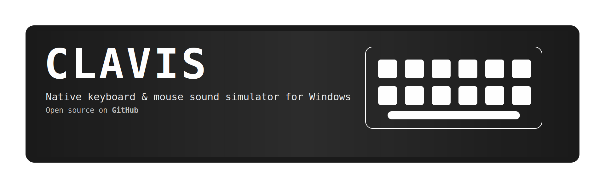
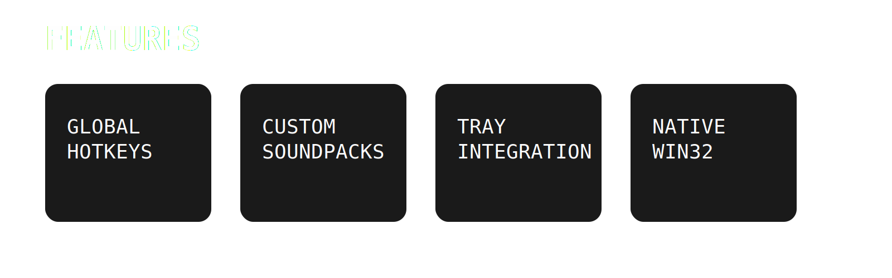
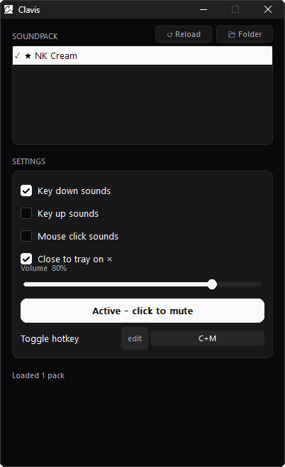
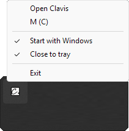

<a href="https://github.com/sponsors/thenolle?frequency=recurring&sponsor=thenolle">
  
</a>


<div align="center">

### Lightweight keyboard & mouse sound simulator for Windows

Native Win32 application with global mute hotkeys, tray integration, embedded soundpacks, and custom soundpack support.

</div>

<br>

<div align="center" style="display: flex; flex-wrap: wrap; justify-content: center; align-items: center; gap: 20px; margin-top: 40px;">
  <a href="https://github.com/thenolle/Clavis/releases">
    
  </a>

  <a href="https://discord.com/invite/JYDzHfgmrP">
    
  </a>

  <a href="https://ko-fi.com/nolly_">
    
  </a>

  <a href="https://github.com/sponsors/thenolle?frequency=recurring&sponsor=thenolle">
    
  </a>
</div>

---



<div style="margin-top: 10px">

- Native lightweight Win32 `.exe`
- Global mute / unmute hotkey
- Tray icon with quick controls
- Embedded and external soundpack support
- Per-key and single-sound configurations
- Mouse click sound support
- Adjustable playback volume
- Instant pack switching
- Close-to-tray support
- Single-instance application behavior
- Zero-install portable usage

</div>

---

# Interface Preview



<div align="center">
  <sub>Main interface with soundpack list, toggles, volume controls, and hotkey remapping.</sub>
</div>

<br>



<div align="center">
  <sub>Tray integration with mute toggle, startup options, and quick access controls.</sub>
</div>

---

# Getting Started

## 1. Launch Clavis

Run:

```text
Clavis.exe
```

When launched for the first time, Clavis automatically creates:

```text
Soundpacks/
```

next to the executable if the folder does not already exist.

---

## 2. Add Soundpacks

Place soundpack folders inside:

```text
Soundpacks/
```

Example:

```text
Soundpacks/
└── my-pack/
    ├── config.json
    ├── a.wav
    ├── enter.wav
    ├── space.wav
    └── icon.png
```

Clavis scans all subfolders and automatically detects valid soundpacks containing a `config.json`.

---

## 3. Select a Pack

- Open Clavis
- Select a pack from the list
- Start typing

If at least one soundpack exists, Clavis automatically loads the first available pack during startup.

---


Clavis supports both:

- Embedded built-in soundpacks
- External disk-based soundpacks

Every soundpack requires:

```text
config.json
```

plus one or more referenced audio files.

---

# config.json Reference

## Single Sound Configuration

```json
{
  "name": "My Pack",
  "key_define_type": "single",
  "sound": "a.wav",
  "mouse_down": "click.wav",
  "mouse_up": "release.wav"
}
```

This mode plays the same sound for every key press.

---

## Multi-Key Configuration

```json
{
  "name": "NK Cream",
  "key_define_type": "multi",
  "defines": {
    "default": "a.wav",
    "KEY_RETURN": "enter.wav",
    "KEY_SPACE": "space.wav",
    "KEY_LEFTSHIFT": "shift.wav",
    "KEY_RIGHTSHIFT": "shift.wav"
  }
}
```

This mode allows assigning specific sounds to specific keys.

---

## Optional Fields

| Field | Description |
|---|---|
| `defines_up` | Key release sounds |
| `mouse_down` | Mouse click sound |
| `mouse_up` | Mouse release sound |
| `default` | Fallback key sound |

If no exact key match exists, Clavis falls back to:

1. `default`
2. First loaded sound entry

---

# Supported Key Names

Clavis supports many Win32 virtual keys including:

```text
KEY_A -> KEY_Z
KEY_0 -> KEY_9
KEY_RETURN
KEY_SPACE
KEY_TAB
KEY_BACKSPACE
KEY_LEFTSHIFT
KEY_RIGHTSHIFT
KEY_LEFTCTRL
KEY_RIGHTCTRL
KEY_LEFTALT
KEY_RIGHTALT
KEY_F1 -> KEY_F12
KEY_LEFT
KEY_RIGHT
KEY_UP
KEY_DOWN
```

Useful examples:

| Key | Name |
|---|---|
| Enter | `KEY_RETURN` |
| Space | `KEY_SPACE` |
| Backspace | `KEY_BACKSPACE` |
| Left Shift | `KEY_LEFTSHIFT` |
| Right Ctrl | `KEY_RIGHTCTRL` |

---


Clavis registers a global Windows hotkey allowing mute toggling even when the application is unfocused.

## Default Hotkey

```text
Ctrl + Shift + M
```

---

## Remapping

1. Click the hotkey field
2. Press a new combination
3. Clavis instantly re-registers the shortcut

No restart required.

If registration fails, another application may already be using the same shortcut.

---

# Tray Integration

Clavis includes a fully integrated notification tray icon.

## Supported Actions

- Open / hide window
- Mute / unmute
- Enable startup
- Enable close-to-tray
- Exit application

---

## Tray Behavior

| Action | Result |
|---|---|
| Double left-click tray icon | Show / hide window |
| Right-click tray icon | Open tray menu |
| Close button with close-to-tray enabled | Hide instead of exit |

Clavis uses a single-instance mutex, preventing duplicate launches while already running.

---

# Audio Behavior

Clavis plays sounds from:

- Embedded memory-loaded assets
- Disk-based sound files

The current volume level applies instantly to playback.

Mute disables playback without unloading the active soundpack, allowing immediate resume.

---

# Recommended Audio Setup

For best results:

- Use short `.wav` files
- Keep filenames exact
- Add a `default` key
- Keep packs organized
- Use normalized audio levels

---

# Troubleshooting

## Soundpack does not appear

Verify:

- Pack is inside `Soundpacks`
- `config.json` exists directly in the pack folder

---

## No sound playback

Verify:

- A pack is selected
- Clavis is not muted
- Volume is above zero
- Relevant sound toggles are enabled

---

## Hotkey does not work

Another application may already be using the shortcut.

Try a different combination.

---

## Closing the app only hides it

Close-to-tray is enabled.

Use the tray icon to reopen Clavis or fully exit.

---

# Technical Details

| Component | Details |
|---|---|
| Platform | Windows |
| Architecture | Native Win32 |
| Distribution | Portable `.exe` |
| Audio Source | Embedded + Disk |
| Input Hooks | Keyboard + Mouse |
| Hotkeys | Global Windows Registration |
| Tray Support | Native Notification Area |
| Runtime | Lightweight Native Execution |

---

# Folder Structure

```text
Clavis/
├── Clavis.exe
└── Soundpacks/
    ├── Pack One/
    │   ├── config.json
    │   ├── a.wav
    │   └── enter.wav
    │
    └── Pack Two/
        ├── config.json
        └── click.wav
```

---

# Support The Project

<div>
  <p style="margin: 0">
    If you enjoy Clavis and want to support development, consider sponsoring or donating.
  </p>

  <p style="margin: 0">
    Support helps fund maintenance, improvements, soundpacks, and future releases.
  </p>
</div>

<br>

<table>
  <tr>
    <th align="center">Platform</th>
    <th align="center">Link</th>
  </tr>

  <tr>
    <td align="center">
      GitHub Sponsors
    </td>
    <td align="center">
      <a href="https://github.com/sponsors/thenolle?frequency=recurring&sponsor=thenolle">
        
      </a>
    </td>
  </tr>
  <tr>
    <td align="center">
      Ko-fi
    </td>
    <td align="center">
      <a href="https://ko-fi.com/nolly_">
        
      </a>
    </td>
  </tr>
</table>

---

# License

This project is licensed under the terms of the license included in the repository.

---

